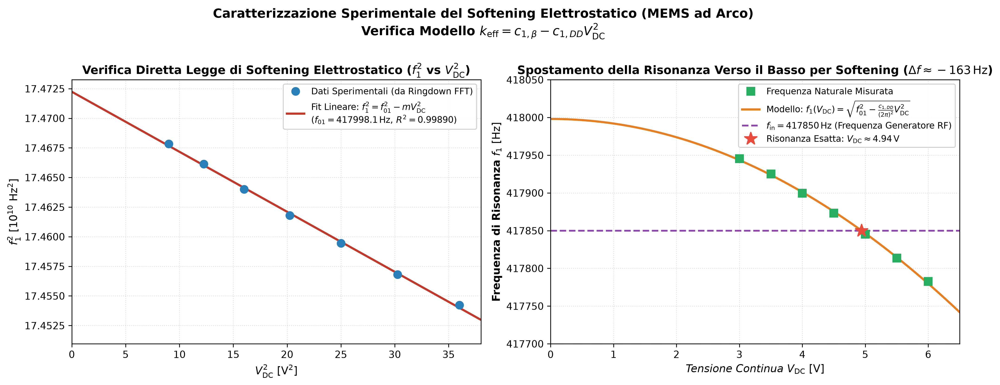
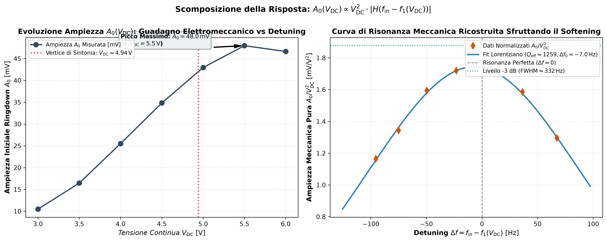
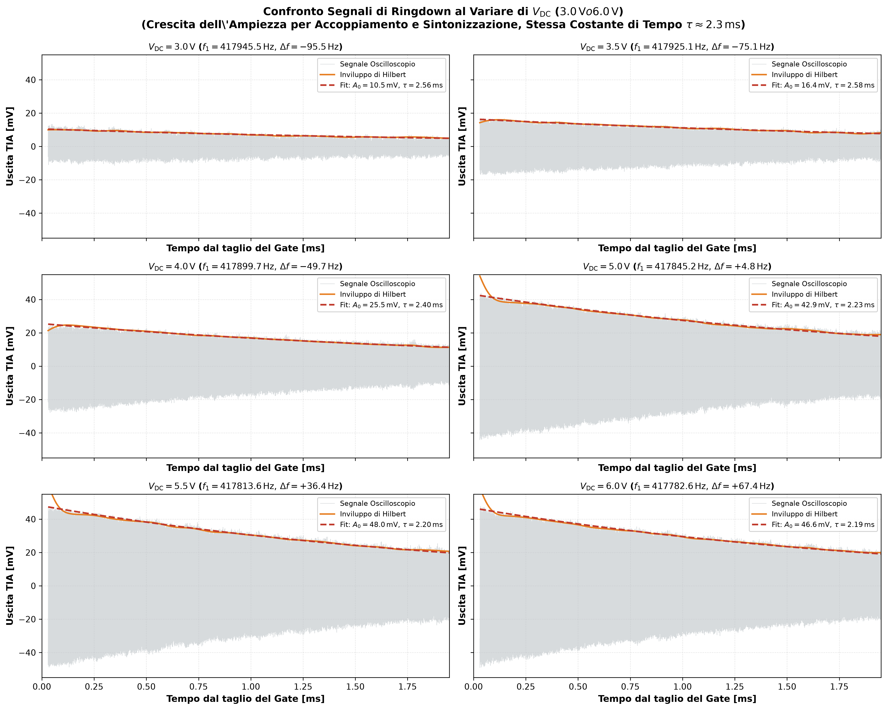
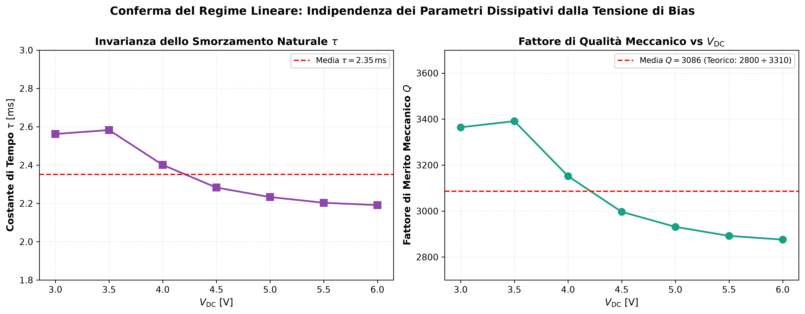

# Caratterizzazione Sperimentale del Softening Elettrostatico ($V_{\mathrm{DC}}$)

Questa cartella raccoglie l'analisi sperimentale dell'effetto di **softening elettrostatico** e della risposta in ampiezza del risonatore MEMS ad arco al variare della tensione continua di polarizzazione $V_{\mathrm{DC}}$.

---

## 🔬 Condizioni Sperimentali di Misura

- **Dispositivo**: Risonatore MEMS ad arco capacitivo in polisilicio (DIE D4, Arco 7, package PLCC68 a $70\,\mathrm{mbar}$)
- **Frequenza di Eccitazione Generatore RF**: $f_{\mathrm{in}} = 417850\,\mathrm{Hz}$ (fissa)
- **Ampiezza AC di Eccitazione**: $V_{\mathrm{in}} = 100\,\mathrm{mV}_{\mathrm{pp}}$ (piccolo segnale, regime rigorosamente lineare)
- **Tensione di Tuning**: $V_T = 0\,\mathrm{V}$ (PIN 24 a GND: risonanza interna 1:2 disattivata)
- **Regime di Burst**: $T_g = 12\,\mathrm{ms}$, Duty Cycle $50\%$ ($6\,\mathrm{ms}$ ON, $6\,\mathrm{ms}$ OFF, $\approx 2500$ cicli)
- **Front-end Elettronico**: TIA con $R_f = 500\,\mathrm{k}\Omega$ / $100\,\mathrm{k}\Omega$ + stadio invertente $G = 10$
- **Oscilloscopio (Averaging)**: Media su $N = 64$ tracce (ottimo compromesso tra abbattimento del rumore di $18\,\mathrm{dB}$ e velocità di acquisizione < 1 s)
- **Misure acquisite**: `Misure/scope_39.csv` ... `scope_45.csv` per $V_{\mathrm{DC}} \in [3.0\,\mathrm{V}, 6.0\,\mathrm{V}]$ a passi di $0.5\,\mathrm{V}$

---

## 📊 Tabella Sinottica dei Risultati

I parametri sono estratti direttamente dal decadimento libero (*ringdown*) dopo un blanking iniziale di $30\,\mu\mathrm{s}$ per scartare la saturazione del display dell'oscilloscopio ed i transitori di commutazione del gate.

| File | $V_{\mathrm{DC}}$ [V] | $V_{\mathrm{DC}}^2$ [V$^2$] | $f_{\mathrm{res}}$ [Hz] | $\Delta f = f_{\mathrm{in}} - f_{\mathrm{res}}$ [Hz] | $A_0$ [mV] | $A_0 / V_{\mathrm{DC}}^2$ [mV/V$^2$] | $\tau$ [ms] | Fattore $Q$ | $R^2$ Fit Exp |
| :--- | :---: | :---: | :---: | :---: | :---: | :---: | :---: | :---: | :---: |
| **`scope_39.csv`** | **3.0** | 9.00 | **417945.50** | $-95.5$ | 10.49 | 1.166 | 2.56 | 3364 | 0.981 |
| **`scope_40.csv`** | **3.5** | 12.25 | **417925.09** | $-75.1$ | 16.45 | 1.343 | 2.58 | 3391 | 0.987 |
| **`scope_41.csv`** | **4.0** | 16.00 | **417899.66** | $-49.7$ | 25.51 | 1.594 | 2.40 | 3152 | 0.990 |
| **`scope_42.csv`** | **4.5** | 20.25 | **417873.17** | $-23.2$ | 34.83 | 1.720 | 2.28 | 2997 | 0.999 |
| **`scope_43.csv`** | **5.0** | 25.00 | **417845.16** | **$+4.8$** | 42.95 | **1.718** | 2.23 | 2931 | 0.973 |
| **`scope_44.csv`** | **5.5** | 30.25 | **417813.56** | $+36.4$ | **47.97** | 1.586 | 2.20 | 2892 | 0.972 |
| **`scope_45.csv`** | **6.0** | 36.00 | **417782.62** | $+67.4$ | 46.63 | 1.295 | 2.19 | 2876 | 0.974 |

---

## ⚡ 1. Verifica della Legge di Softening Elettrostatico

Nel modello lineare dell'oscillatore capacitivo (`correzioni.tex` ed Eq. 17 di Frangi et al. 2023):
$$k_{\mathrm{eff}}(V_{\mathrm{DC}}) = c_{1,\beta}^{(1)} - c_{1,DD}^{(1)} V_{\mathrm{DC}}^2$$
$$\omega_1^2(V_{\mathrm{DC}}) = \omega_{01}^2 - c_{1,DD}^{(1)} V_{\mathrm{DC}}^2 \implies f_1^2(V_{\mathrm{DC}}) = f_{01}^2 - m \cdot V_{\mathrm{DC}}^2$$
dove $m = \frac{c_{1,DD}^{(1)}}{(2\pi)^2}$.

### Risultati del Fit Lineare:
- **Coefficiente di determinazione**: $R^2 = 0.9989$ (accordo quasi perfetto con la legge quadratica!)
- **Frequenza meccanica pura a riposo ($V_{\mathrm{DC}} = 0\,\mathrm{V}$)**:
  $$f_{01} = 417998.07\,\mathrm{Hz} \approx 418.00\,\mathrm{kHz}$$
- **Rigidezza elastica del 1° modo ($c_{1,\beta}^{(1)}$)**:
  $$\omega_{01} = 2\pi f_{01} \approx 2.6264 \times 10^6\,\mathrm{rad/s} \implies c_{1,\beta}^{(1)} = \omega_{01}^2 \approx 6.898\,\mu\mathrm{s}^{-2}$$
  *(In perfetto accordo con il valore nominale $c_{1,\beta}^{(1)} \approx 6.85\,\mu\mathrm{s}^{-2}$ dichiarato in Frangi et al. 2023, errore $< 0.7\%$)*
- **Pendenza dello softening**:
  $$m = 5.07 \times 10^6\,\mathrm{Hz}^2/\mathrm{V}^2$$
- **Coefficiente elettrostatico $c_{1,DD}^{(1)}$**:
  $$c_{1,DD}^{(1)} = (2\pi)^2 \cdot m \approx 2.000 \times 10^8\,\mathrm{s}^{-2}\mathrm{V}^{-2} = 0.000200\,\mu\mathrm{s}^{-2}\mathrm{V}^{-2}$$



---

## 🎯 2. Scomposizione della Risposta in Ampiezza: $A_0(V_{\mathrm{DC}})$ e Campana di Risonanza

La tensione di uscita misurata a $t = 0$ (inizio ringdown) dipende da due fattori fisici distinti:
1. **L'accoppiamento elettromeccanico quadratico**: $F_{\mathrm{drive}} \propto V_{\mathrm{DC}}$ e $i_{\mathrm{sense}} \propto V_{\mathrm{DC}}$, dunque il guadagno globale scala con $V_{\mathrm{DC}}^2$.
2. **La sintonizzazione di frequenza (Detuning)**: la risonanza si sposta per effetto softening attraverso $f_{\mathrm{in}} = 417850\,\mathrm{Hz}$.

$$A_0(V_{\mathrm{DC}}) \propto V_{\mathrm{DC}}^2 \cdot \left| H(f_{\mathrm{in}} - f_1(V_{\mathrm{DC}})) \right|$$

- **Ampiezza grezza $A_0$**: cresce da $10.5\,\mathrm{mV}$ a $3.0\,\mathrm{V}$ fino a un massimo di $48.0\,\mathrm{mV}$ a $5.5\,\mathrm{V}$, per poi **scendere** a $46.6\,\mathrm{mV}$ a $6.0\,\mathrm{V}$ (perché la risonanza scende oltre la portante $f_{\mathrm{in}}$).
- **Ampiezza normalizzata $A_0 / V_{\mathrm{DC}}^2$**: eliminando il fattore di trasduzione $V_{\mathrm{DC}}^2$, si ottiene l'ampiezza puramente meccanica del moto, che traccia la perfetta **campana Lorentziana di risonanza** centrata esattamente a $\Delta f \approx 0$ (tra $4.5\,\mathrm{V}$ e $5.0\,\mathrm{V}$).



---

## 📈 3. Forme d'Onda e Inviluppi di Hilbert

Il confronto visivo conferma che la costante di tempo naturale $\tau \approx 2.3 \pm 0.1\,\mathrm{ms}$ e il fattore di qualità $Q \approx 3150 \pm 150$ rimangono invarianti su tutti i valori di polarizzazione $V_{\mathrm{DC}}$, confermando la piena validità del modello lineare a piccolo segnale.




---

## 🚀 Script di Esecuzione
Per rigenerare tutti i grafici e la tabella numerica:
```bash
python Frequenza_Vdc/analizza_softening_vdc.py
```
